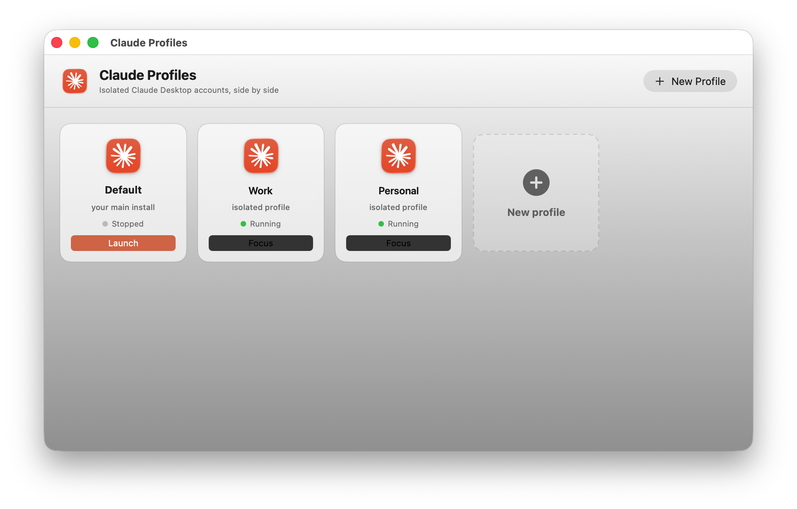

# Claude Desktop Profiles

**Run multiple Claude Desktop accounts side by side on macOS** — work and
personal, or one per client — with a native profile manager, Spotlight
launchers, and a tiny CLI. No Electron, no npm, no telemetry, no network
calls. Built locally on your machine from ~700 lines of code you can read
in one sitting.



## Why

Claude Desktop supports exactly one logged-in account. If you have a Team
account at work and a personal account for your own projects, you're stuck
logging out and back in — losing context every time. Claude Desktop is an
Electron app, though, and honors Chromium's `--user-data-dir` flag: point it
at a different folder and you get a **fully isolated instance** — its own
login, chats, settings, projects, and MCP connectors. This project wraps that
one flag in a native macOS experience.

## What you get

- **Claude Profiles app** — a SwiftUI window with a card per profile:
  live running indicators, one-click launch, add and remove built in.
  ⌘Space → "Claude Profiles".
- **Per-profile Spotlight launchers** — every profile also gets its own
  "Claude Work.app" / "Claude Personal.app" with the Claude icon, dock-able
  like any app.
- **A CLI (`cdp`)** — `cdp add personal`, `cdp list`, `cdp remove`, for
  scripting and dotfiles people.
- **AppleScript fallback** — no Xcode Command Line Tools? `cdp chooser`
  builds a zero-dependency dialog picker with the same features.

All three frontends drive the same implementation: the GUI bundles a copy of
the `cdp` script and shells out to it.

## Install

```sh
git clone https://github.com/odahcam/claude-desktop-profiles.git
cd claude-desktop-profiles
./install.sh
```

The installer compiles the app locally (Swift toolchain via Xcode Command
Line Tools; it falls back to the AppleScript picker without it) and links
`cdp` onto your PATH. Nothing is downloaded at build time.

## Usage

⌘Space → "Claude Profiles" → **New profile**. Or:

```sh
cdp add personal     # create profile + "Claude Personal" Spotlight launcher
cdp list             # profiles and launcher health
cdp remove personal  # remove launcher; asks before touching data
cdp gui              # (re)build + install the SwiftUI app
cdp chooser          # build the AppleScript picker instead
```

## Signing in to a new profile — read this once

Claude's login hands the auth token over a `claude://` deep link, and macOS
routes that link to **whichever Claude instance is running**. The first time
you launch a new profile:

1. Quit every other Claude window (⌘Q).
2. Launch the new profile and sign in.
3. Done — from now on all profiles run simultaneously without conflict.

If the token ever lands on the wrong instance, no data is lost — just sign
that instance back into its own account.

## How it works

- A profile **is** a folder: `~/Library/Application Support/Claude-<Name>`.
  There is no registry, database, or state file — the GUI, the chooser, and
  the CLI all discover profiles from the filesystem at runtime.
- Launchers are built with `osacompile` and run
  `open -n -a Claude.app --args --user-data-dir=<folder>` (`-n` forces a new
  instance instead of focusing the running one).
- Each launcher gets a unique `CFBundleIdentifier` (LaunchServices otherwise
  treats all AppleScript applets as the same app and misroutes Dock clicks),
  the Claude `.icns`, and a fresh ad-hoc `codesign` (editing a bundle after
  compilation breaks its seal, which Gatekeeper reports as "damaged").
- Running-instance detection reads each Claude process's `--user-data-dir`
  argument from `ps` — all instances share one binary, so the flag is the
  only distinguishing feature.
- Your default Claude install is never touched. Profiles are created empty
  and never copy credentials; each is signed in independently.

## FAQ

**Does this touch my existing Claude?** No. The default install keeps using
`~/Library/Application Support/Claude`; this tool never reads or writes it.

**Claude Code (the CLI)?** Different mechanism — set `CLAUDE_CONFIG_DIR` per
account, or see tools like claude-swap. Out of scope here by design.

**iPhone/Android?** Not solvable from the outside: the mobile apps hold a
single session with no override. App + claude.ai in the browser is the only
two-account setup on a phone.

**Is this against the ToS?** It's the same app, launched with a documented
Chromium flag, signed into accounts you own. Nothing is patched, injected,
or intercepted.

**Both instances show the same Dock icon while running.** macOS limitation:
running instances share one binary. Tell them apart by their windows; the
Spotlight launchers are distinct.

## Acknowledgments

Not a fork of anything — all code here is original — but the underlying
recipe is community knowledge, and [claude-multiprofile](https://github.com/jmdarre-v/claude-multiprofile)
deserves credit as prior art that proved the approach solid.

## License

[MIT](LICENSE)
